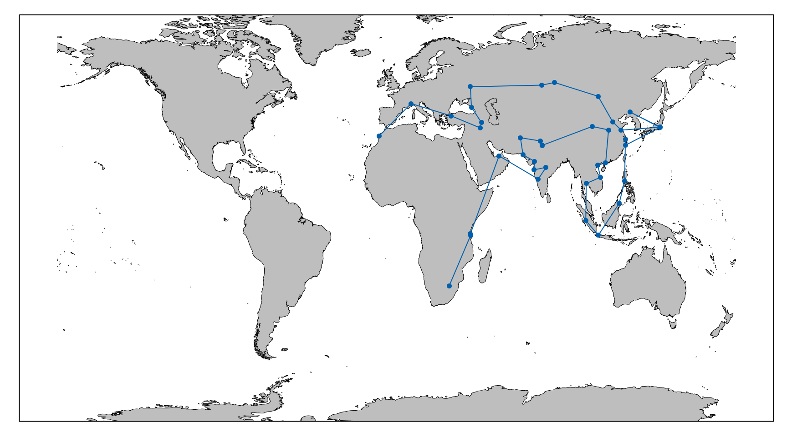

# threshold-accepting-tsp
Threshold Accepting for TSP

### Dependencies
* Rust v1.5
* Cargo v1.5
* Gnuplot v5.4

### Build

```bash
cargo build --release
```

### Input

A seed range `n m` for pseudo-random numbers.

```
n,n+1,n+2,..,m
```

The initial temperature.

Epsilon to finish.

Temperature decrement for each iteration.

Number of neighbors to search in every batch.

A file with the `id` of every city with this format.

```
1,2,3,4,5,6,7,75,163,164,165,....
```

### Run

`initial_seed`: The initial seed for range.

`final_seed`: The final seed for range (inclusive).

`temperature`: Temperature

`epsilon`: Lower bound temperature.

`decrement`: Decrement percent of temperature.

`iterations`: Number of neighbors to search.

`path_file`: The path of file with the id of every city.

```bash
cargo run --release <initial_seed> <final_seed> <temperature> <epsilon> <decrement> <iterations> <path_file>
```

As result there is a file `data.dat` in `data` dir which have the sorted coordinates of the best path found. 

Then run the Gnuplot script in `data` dir to see the output.

```bash
cd data
gnuplot load_graph.gp
```

<div class="col-md-offset">
  
</div>

Also, there is a file `log.dat` in `log` dir with the solution of every seed, also, there is a file `log1.dat` in same dir with the cost of every solution before to reach best solution.

And run the Gnuplot script in `log` dir to see the output.

```bash
cd log
gnuplot load_log.gp
```

<div class="col-md-offset">
  
</div>

### Example

```bash
cargo run --release 1 10 7 0.0001 0.99 20 examples/example-1.txt
```

### Test

```bash
cargo test
```
